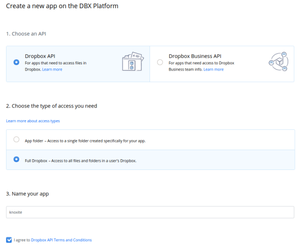
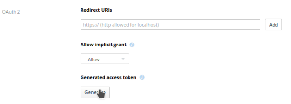
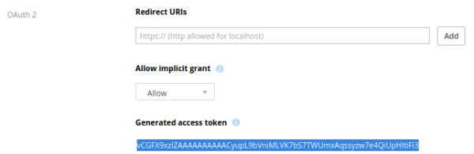

# Dropbox

This is the storage backend for the [dropbox](https://www.dropbox.com) cloud
storage.

# Usage

You'll just need to provide the OAuth2 access token without any username in
the knoxite URL scheme in order to interact with this backend:

```
knoxite repo init -r dropbox://generated_access_token@/desired/path
```

# Receive an access token

Assuming you already have an account on dropbox you'll have to create an app for
the platform. This can be done [here](https://dropbox.com/developers/apps/). You
can either grant knoxite full access to all folders on dropbox or just access to
a single folder dedicated for it. Note that the name of your app has to be
unique.



After creating the app you'll land on its info page. Here you'll need to
generate the OAuth 2 access token for knoxite. This can be done with a single
click on the corresponding button.



This generated token can now be used in knoxites URL scheme. It's better to save
this token in a secure place as dropboxs interface will not redisplay it (but
you can always generate a new one for the app).


